# Mito Analyzer user manual (v1.1)

한국어: [manual_ko.md](manual_ko.md)

This manual takes a first-time user from installation to reading the results.
How each step is computed is in [algorithm.md](algorithm.md) (Korean), and what each metric in the result tables means is in [metrics.md](metrics.md) (Korean).
The screenshots were made with synthetic example images.

## Contents
1. What the program does
2. Installation
3. Preparing images
4. Your first analysis, step by step
5. The Run tab
6. Every option
6-1. Reviewing and editing the cell ROIs
7. Manual thresholds and the live preview
8. Pixel size (µm/px)
9. Groups
10. Results of one image
11. The Analysis tab: all samples together
12. Output files
13. Reading the results
14. Command line
15. Troubleshooting (FAQ)

---

## 1. What the program does
From three-channel (red, green, blue) fluorescence images it finds **every cell**, and for each cell measures
- **mitochondrial morphology**: how long and connected, or how fragmented, the mitochondria are (the same measures as Fiji's MiNA)
- **how much of a protein of interest (green) sits on the mitochondria**: green on mito, fractions, bright green puncta

then shows how the two relate (correlation, regression) and how **experimental groups differ**.

| Channel | Typical stain | Used for |
|---|---|---|
| Red | MitoTracker or another mito marker | mito morphology, cell borders |
| Green | protein of interest (e.g. an mNeonGreen fusion) | green on mito, green+ / green− cells |
| Blue | DAPI / Hoechst nuclei | one nucleus = one cell, the centre of each cell |

## 2. Installation
Pick one of three ways. **To analyse data only, use 2-1**; **to change the code as you go, use 2-3**.

### 2-1. DMG (easiest, no Python needed)
1. Download `Mito Analyzer-1.1.1-apple-silicon.dmg` and double-click it.
2. In the window that opens, drag **Mito Analyzer** onto the **Applications** folder icon.
3. The app is not signed by Apple, so the first start may be blocked ("unidentified developer"):
   - in Applications, **right-click the app → Open → Open**, or
   - **System Settings → Privacy & Security**, press **"Open Anyway"** at the bottom, then open the app again.
   You only do this once.
- This build runs on Apple-silicon Macs (M1 or later). On Intel Macs use 2-2 or 2-3.

### 2-2. One-line install (builds the app for you)
Open Terminal (Applications → Utilities → Terminal), paste this line and press Enter:
```bash
curl -fsSL https://raw.githubusercontent.com/windowrainYOON/mito-tracking/main/install.sh | bash
```
It downloads the code, installs Python in your home folder if you have none (no admin rights needed), builds the app and pins it to the Dock (about 5 minutes the first time). Run the same line again to update.
- Location: `~/Applications/MitoAnalyzer` (put `MITO_DIR=path` in front to change it)
- If the main branch does not have the latest version yet, install the development branch: `curl … | MITO_REF=develop bash`

### 2-3. Build it yourself (to change the code)
```bash
git clone https://github.com/windowrainYOON/mito-tracking.git
cd mito-tracking/application
./build_mac.sh --add-to-dock
```
- Needs Python 3.11 or newer (3.12+ recommended); the script tells you how to install it if it is missing.
- After editing the code, run `./build_mac.sh` again: the app is rebuilt in the same place and the Dock icon opens the new version.
- Options: `--clean` (fresh environment), `--locked` (validated package versions), `--dmg` (also make a DMG to give to others)
- Windows / Linux: `python3 -m venv .venv && .venv/bin/pip install -r requirements.txt`, then `.venv/bin/python run_app.py`

## 3. Preparing images
- Save the three channels of **one field of view** as **separate TIFF files** (Fiji/ImageJ RGB exports or single-channel 8/16-bit).
- **File names**: the three files must share the part before the channel and end in `Red` / `Green` / `Blue`. A channel number (`Ch1` …) is optional.
  ```
  Processed_New01_Ch1_Red.tif
  Processed_New01_Ch2_Green.tif
  Processed_New01_Ch3_Blue.tif
  ```
- **Folders (recommended)**: one folder per condition. A folder is searched with all its subfolders, and its name becomes the *Dataset* and the default *Group*.
  ```
  My experiment/
    Control/        ← several image sets
    PRD 24h/
      Processed/New-01_results/…_Red.tif …   (subfolders are fine)
  ```
- **Scale bars** (white text and bars) are removed automatically before the analysis.
- **Pixel size**: read automatically from TIFFs saved with a µm calibration (Fiji: Image → Properties). If it is missing, see section 8.
- Fields with about 5–20 cells that lie fully inside the image work best; cells cut by the image edge may be left out.

### 3-1. Zeiss CZI files
A `.czi` file from ZEN holds all channels of a field, so **one CZI file is one image set**; no naming rule is needed.
- Add CZI files like TIFFs (Add files…, Add folder…, or drop them on the table). Folders may mix TIFFs and CZIs.
- **Channel roles** are guessed from the channel names in the file: a DNA stain (DAPI, Hoechst, …) is the nucleus,
  the longest emission wavelength is the mito channel and the remaining one the protein (POI). The guess is shown in the
  Red / Green / Blue columns as `file.czi ch0 AF568-T1` etc. **Check it once.**
- To change it for many files at once: select the rows (or none = all CZI rows), press **Channel roles…**
  (or double-click a Red / Green / Blue cell of a CZI row), and choose *Mito*, *Protein (POI)*, *Nucleus* or
  *Not used* for each channel. The choice applies by channel number to every chosen file, and CZI files you add later
  with the same channel names get the same roles.

  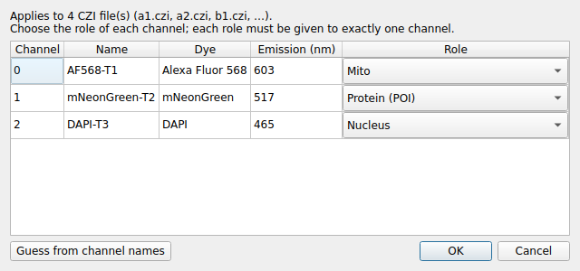
- The pixel size is read from the CZI metadata (shown as *CZI* in the µm/px tooltip and the settings sheet).
- z-stacks are analysed as their maximum-intensity projection; with several scenes or time points the first one is used;
  tiles of a mosaic are stitched. Images of more than 8 bits are scaled to 0–255 with one fixed factor per bit depth
  (e.g. 12-bit ÷ 16), never per image, so intensities stay comparable within a batch.
- Raw CZI data are usually darker than *Processed* TIFF exports of the same field; the automatic thresholds adapt per
  image, but do not reuse manual threshold values tuned on processed TIFFs without checking them in the preview.

## 4. Your first analysis, step by step
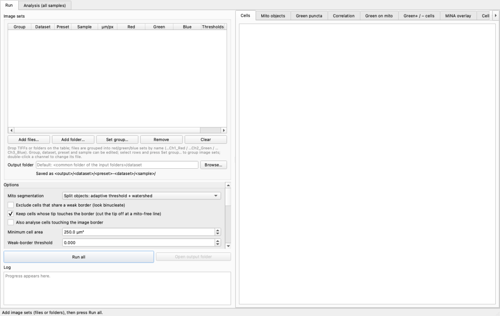

1. **Open the app.** There are two tabs at the top, **Run** and **Analysis (all samples)**; you start in Run.
2. **Add your images.** Press **Add folder…** and choose a condition folder (e.g. `Control`), or drag folders from Finder onto the table. Repeat for each condition.
   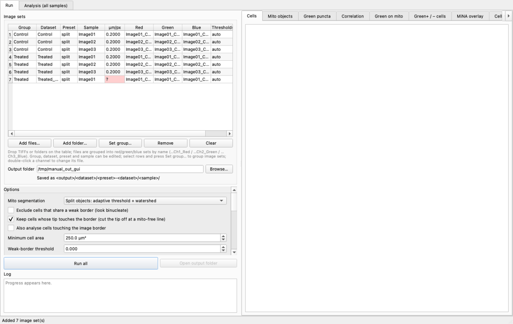
   - One row = one image set (red, green and blue file).
   - A red `?` in the **µm/px** column means the file has no pixel size (section 8); you are asked for it when you press Run all.
3. **Check the groups.** The *Group* column holds the experimental groups to compare (default: the folder name). Double-click a cell to change it, or select several rows and press **Set group…**.
4. **Choose the output folder.** Pick where the results go in *Output folder*. Left empty, a `dataset` folder is made in the common parent folder of your input folders.
   - Use a folder outside your raw-data folder.
5. **Leave the options at their defaults** for the first run; they suit most images.
6. **Press Run all.** Progress shows in the *Log* and the *Status* column. The same button (**Stop**) finishes the current image and stops.
   - First only the **cell ROIs** of every image are found (10–15 s per image), then the **ROI review window** opens. Check the cells, fix them if needed and press **Confirm ROIs and continue analysis**; the rest of the analysis (about 20 s per image) follows. See section 6-1.
   - To run everything automatically without the review, turn off *Review and edit the cell ROIs before the analysis* in Options.
7. **Look at the results.** Click a finished row: its results appear in the tabs on the right (section 10).
   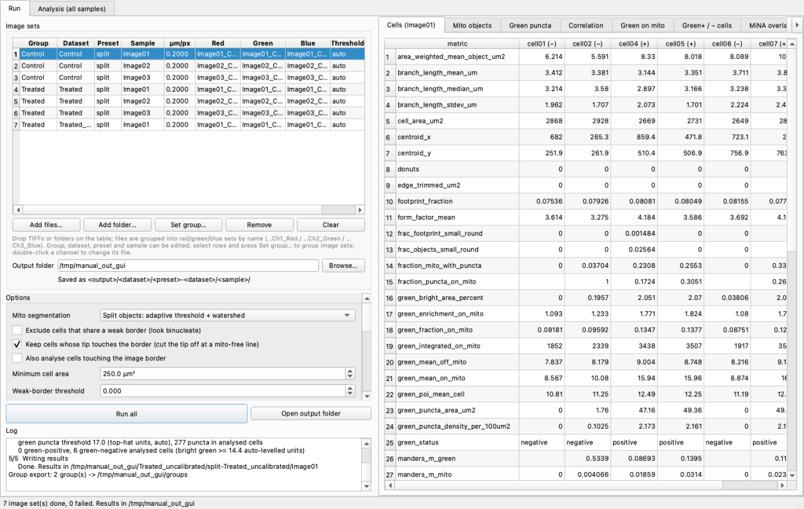
8. **Check the Cell ROIs tab first.** Thick red outline = analysed cell, grey dotted = left out because it touches the image edge.
   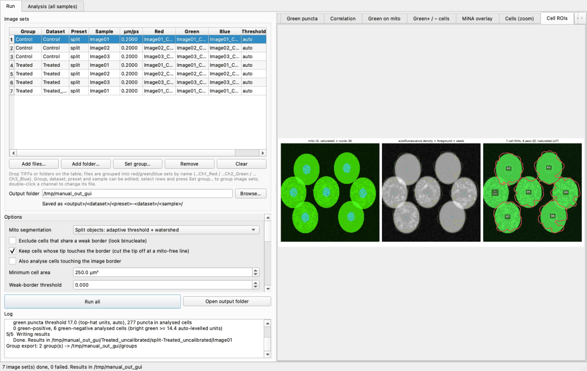
   If many cells are wrong, see section 7 (thresholds) and section 15 (troubleshooting).
9. **Compare the groups.** Go to the **Analysis (all samples)** tab; the results folder you just made is already loaded (section 11).

## 5. The Run tab
| Area | What it holds |
|---|---|
| **Image sets** table | Group · Dataset · Preset · Sample · µm/px · Red · Green · Blue · Thresholds · Status |
| Buttons under the table | **Add files…** (several files), **Add folder…** (a folder and its subfolders), **Set group…** (group of the selected rows), **Channel roles…** (CZI files, 3-1), **Remove** (selected rows), **Clear** (all rows) |
| **Output folder** | where results go, as `<output>/<dataset>/<preset>-<dataset>/<sample>/` |
| **Options** | analysis settings (section 6); scroll down to see them all |
| **Run all / Stop** | analyse every set in turn / finish the current set and stop |
| **Open output folder** | show the results in Finder |
| **Log** | progress and warnings |
| Tabs on the right | results of the selected image (section 10) |

Editable table cells
- **Group**: the experimental group (section 9)
- **Dataset**: part of the output folder name (default: the folder you added)
- **Preset**: another folder label (default: the mito method, `split` / `otsu`). Give a different preset when you rerun the same data with other settings, so the results do not mix.
- **Sample**: the image name (default: the file name without the channel part)
- **µm/px**: pixel size; double-click to type it (section 8)
- **Red / Green / Blue**: double-click to pick a different file for that channel (for a CZI row: to change the channel roles, 3-1). Red = mito, Green = protein (POI), Blue = nucleus.
- **Thresholds**: manual thresholds for this image only (section 7), set in the preview window

## 6. Every option
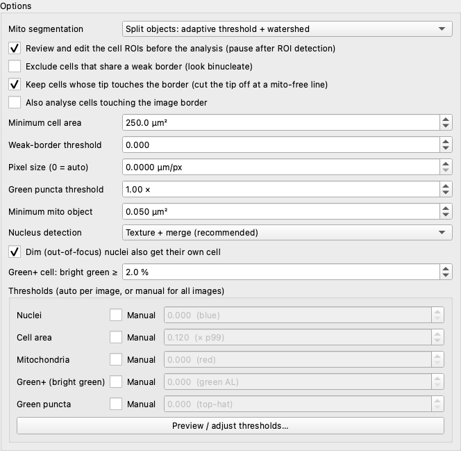

| Option | Default | What it does | When to change it |
|---|---|---|---|
| Review and edit the cell ROIs before the analysis | on | Stops after the cell ROIs are found and opens the review window (section 6-1) | turn off for a fully automatic run |
| Mito segmentation | Split objects | How mitochondria are segmented. *Split objects*: local threshold, touching mitochondria split at dark, narrow contacts (adds fragmentation metrics). *MiNA classic*: one Otsu threshold per cell, as Fiji MiNA | MiNA classic only to compare with Fiji MiNA directly |
| Exclude cells that share a weak border | off | Leaves out neighbouring cells without a clear border between them (look binucleate) | crowded cells with uncertain borders, for a conservative analysis |
| Keep cells whose tip touches the border | on | A cell whose nucleus is well inside the image but whose tip reaches the edge is cut at the line where its mitochondria stop and analysed (the cut part is hatched) | turn off to leave such cells out entirely |
| Also analyse cells touching the image border | off | Analyses cells that touch the edge too | normally keep off (cut-off cells would be included) |
| Minimum cell area | 250 µm² | Smaller cell ROIs are dropped | lower it for very small cells |
| Weak-border threshold | 0.000 | Border-contrast level for "weak border" pairs (with the option above) | rarely |
| Pixel size (0 = auto) | 0 | 0 reads it from each file; a value is used for **every** image | when the files have no or wrong calibration |
| Green puncta threshold | 1.00 × | Factor on the automatic puncta threshold: above 1 fewer, brighter puncta; below 1 more | too many / too few puncta (or a manual value, section 7) |
| Minimum mito object | 0.05 µm² | Smaller mito pieces are left out of the mito-object table | raise it with noisy images |
| Nucleus detection | Texture + merge | How nuclei are found: real nuclei are told from diffuse blue by their chromatin texture, curved nuclei stay whole, touching nuclei stay apart. *Texture, no merge* and *Global Otsu (old)* are also available | keep the default; Otsu is fine for very clean nuclear stains |
| Dim (out-of-focus) nuclei also get their own cell | on | Faint nuclei also get a cell, so their mitochondria are not given to a neighbour | almost always on |
| Green+ cell: bright green ≥ | 2.0 % | A cell is green-positive (expressing) when bright green covers at least this share of its cytoplasm | lower for weak expression, raise with bright background |
| Thresholds | all auto | The five thresholds, automatic or manual (section 7) | when the automatic result does not fit |

## 6-1. Reviewing and editing the cell ROIs
With **Review and edit the cell ROIs before the analysis** on (the default), Run all stops after finding the cell ROIs and opens this window. The rest of the analysis uses the ROIs you confirm here.

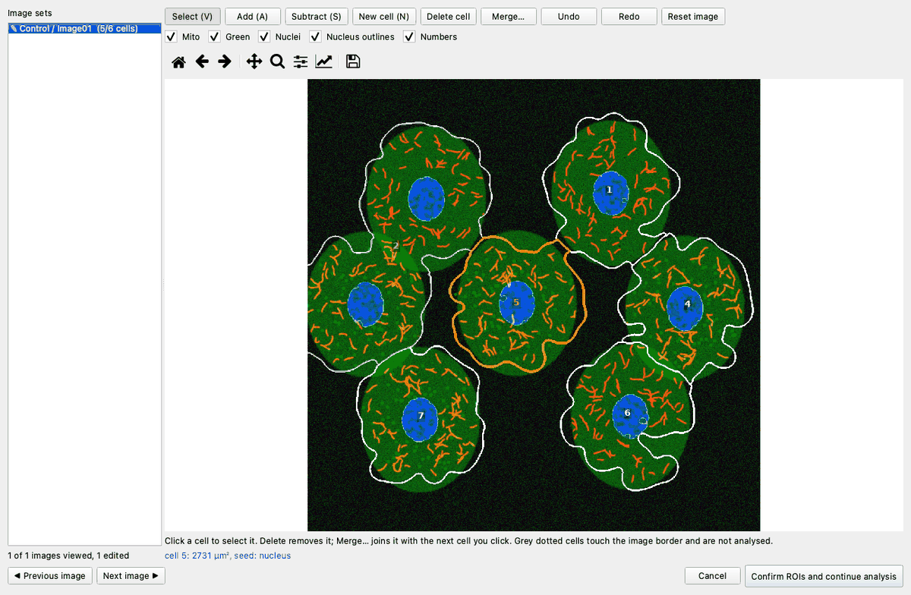

The window
- Left: the image sets, `(analysed cells / all cells)`; ✓ = viewed, ✎ = edited
- Centre: mito (red), green and nuclei (blue) with the cell outlines (white), nucleus outlines (light blue) and numbers
  - **grey** outline and number = touches the image border and will not be analysed; `*` = drawn by hand; thick **yellow** = selected cell
  - checkboxes switch channels, nucleus outlines and numbers on and off
- Zoom / pan: mouse wheel, or the magnifier and hand icons (house = whole image)

Tools (shortcut in brackets)
| Tool | How |
|---|---|
| **Select (V)** | click a cell to select it; its area and seed (nucleus / dim nucleus / drawn) are shown below |
| **Add (A)** | draw around an area to add to the selected cell; area of other cells is taken from them. It must touch the cell |
| **Subtract (S)** | draw around an area to cut from the selected cell (from every cell it touches if none is selected). Draw across the cell border: a cell cannot have a hole |
| **New cell (N)** | draw the outline of a missed cell (only where no other cell is) |
| **Delete cell (Delete)** | delete the selected cell (fake cells, cells to leave out) |
| **Merge… (M)** | select a cell, press Merge…, click the cell to join. For one cell split in two; the cells must touch |
| **Undo / Redo** | ⌘Z / ⇧⌘Z |
| **Reset image** | back to the detected ROIs of this image |
| **Esc** | clear the selection, back to Select |

Common fixes
- **Two cells in one ROI** → Subtract one part, then draw it as a New cell.
- **One cell split in two** → select one part → Merge… → click the other.
- **Background attached to a cell** → select the cell, Subtract around the background.
- **Fake cell** → select → Delete.
- **Missed cell** → draw it with New cell (number with `*`, *seed* column = `manual`).

Finishing
- Step through the images with **◀ Previous / Next ▶**, then **Confirm ROIs and continue analysis**. If some images were not opened you are asked whether to go on with their detected ROIs.
- **Cancel** stops without analysing (nothing is saved).
- The confirmed ROIs are saved in each sample folder as `<sample>_roi_review.npz` and the settings sheet records `rois_reviewed = True`. Running the same images into the same output folder again asks **whether to start from the ROIs reviewed before** (Yes = load your edits, No = detect again).
- Deleted or drawn cells go through the rest of the analysis (mitochondria, green, statistics) like any other cell.

## 7. Manual thresholds and the live preview
Automatic thresholds are computed for every image. When the result looks wrong you can set them yourself.

| Threshold | Decides | Too low | Too high |
|---|---|---|---|
| Nuclei | nucleus candidates | cytoplasm blobs become nuclei → fake cells | faint nuclei are missed → two cells in one ROI |
| Cell area | the cell area (mito density, 0–1) | background joins the cells | cells come out too small |
| Mitochondria | the mito mask | background counted as mito, pieces merge | faint mito missed, over-fragmented |
| Green+ (bright green) | bright green for the green+ call | green− cells called green+ | weakly expressing cells missed |
| Green puncta | bright green spots | noise becomes puncta | real puncta missed |

### How to use it
1. Under Options → Thresholds press **Preview / adjust thresholds…**.
   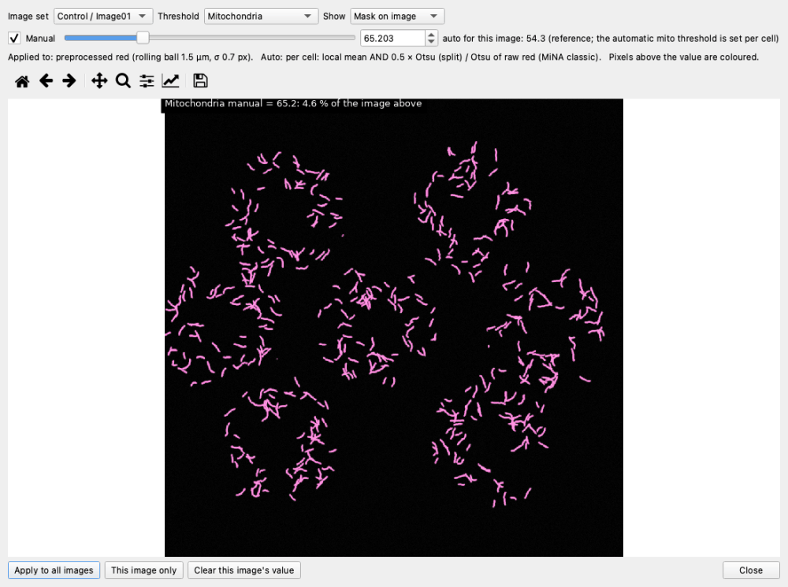
2. Choose the **Image set** and the **Threshold** at the top.
3. Tick **Manual** and move the slider or type a value. The coloured pixels (above the value) are redrawn at once, next to that image's **automatic value**.
   - Zoom and pan with the magnifier and hand icons; *Show* switches between mask, outline and image only.
4. When the value is right:
   - **Apply to all images**: the same value for every image (the Options threshold becomes Manual)
   - **This image only**: for this image only (shown in the table's *Thresholds* column); it wins over the batch value
   - **Clear this image's value**: remove this image's own value
5. Press **Run all** to analyse again.

Tips
- Step through several images and pick **one value that suits all of them**. Different values per image can make group comparisons unfair.
- The values used and the automatic ones are saved in the *settings* sheet of each `_results.xlsx`.
- Where exactly each threshold acts: [algorithm.md, section 6](algorithm.md#6-임계값-수동-조정과-미리보기)

## 8. Pixel size (µm/px)
Every length (µm) and area (µm²) depends on it.
- When the file carries it, it is read automatically and shown in the **µm/px** column (hover to see where it came from).
- When it is missing or implausible (e.g. a 72 dpi screen resolution), a **red `?`** is shown:
  - **Run all** asks once for these sets. Enter the µm/px from the acquisition settings (objective, zoom, pixel count).
  - Or double-click the `?` cell and type it for that set.
- A value in Options → *Pixel size* is used for every image, whatever the files say.
- Check: `_results.xlsx` → *settings* sheet → `pixel_size_um` and `pixel_size_source` (TIFF / CZI / entered / assumed).
- To store it in the files with Fiji: Image → Properties…, Unit = micron, pixel width / height, then save as TIFF.

## 9. Groups
A group is an experimental condition to compare (Control, PRD 24h, Drug A …).
- **When adding images**: the folder name is the default group, so one folder per condition needs no further setup.
- **In the Run tab**: double-click a *Group* cell, or select rows → **Set group…**
- **After the analysis**: **Groups…** in the Analysis tab. Edit the Group column and press **Save**; the change applies at once, without re-analysing.
  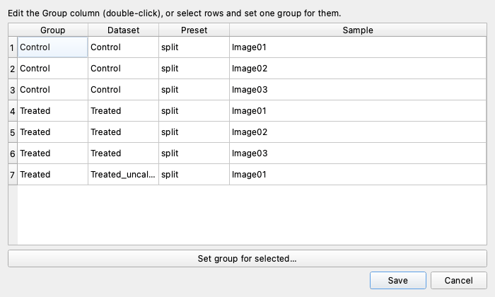
- Groups are stored in `groups.csv` in the results folder.

## 10. Results of one image (right side of the Run tab)
Click a finished row in the table to show its results.

| Tab | Content |
|---|---|
| **Cells** | every metric of every cell (columns = cells, `(+)` / `(−)` = green+ / green−) |
| **Mito objects** | each mito piece: shape and the green on it; filter by green+/− and by cell |
| **Green puncta** | each bright green spot: area, intensity, on or off mito |
| **Correlation** | heatmap of mito × green metric correlations within this image; click a square for its scatter plot |
| **Green on mito** | green on the mito objects (magenta outlines), puncta on mito (yellow) / off mito (cyan) |
| **Green+ / − cells** | bright green (yellow) and the green+ (red outline) / green− (grey) calls |
| **MiNA overlay**, **Cells (zoom)** | mito mask (magenta), skeleton (green), end points (yellow), junctions (blue) |
| **Cell ROIs** | cell borders and numbers: thick red = analysed, grey dotted = left out (edge), hatched = part cut off at the edge |

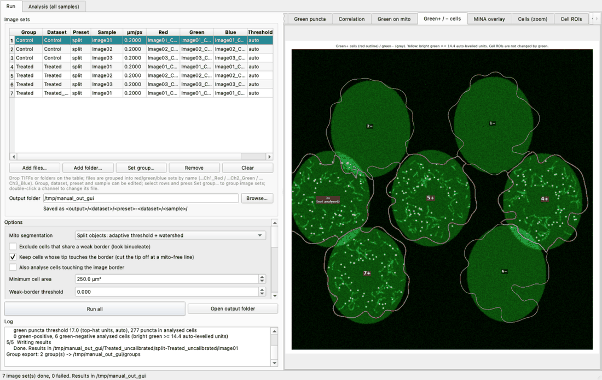

**Suggested order of checks**: Cell ROIs (are cells split correctly?) → Green+ / − cells (is the expression call right?) → MiNA overlay (are mitochondria picked up well?) → tables and plots.

## 11. The Analysis tab: all samples together
After a batch, its results folder is loaded automatically. For earlier results, press **Browse…**, choose the results folder and **Load**.

Buttons at the top
- **Groups…**: change the group of samples (section 9)
- **Export by group…**: rewrite the group-wise tables and the group comparison (section 12), optionally with a control group

### 11-1. Regression / correlation
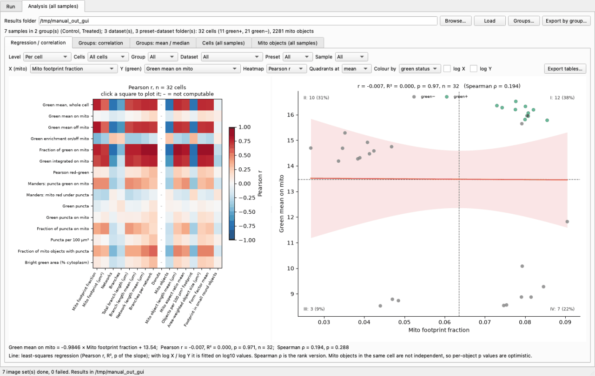
- Left: heatmap of the correlation of every (mito metric × green metric) pair. Red = positive, blue = negative, `–` = not computable (fewer than 3 cells, or a constant value).
- Click a square: scatter plot with the regression line and 95 % band, r, R², p and Spearman ρ, split into quadrants at the mean (or median) with the share of points in each.
- Filter with *Level* (cells / mito objects), *Cells* (all / green+ / green−), *Group*, *Dataset*, *Sample*; colour with *Colour by*; *log X / log Y* for log axes.
- **Export tables…** saves the filtered cell and mito tables and the regression table.

### 11-2. Groups: mean / median (comparing groups)
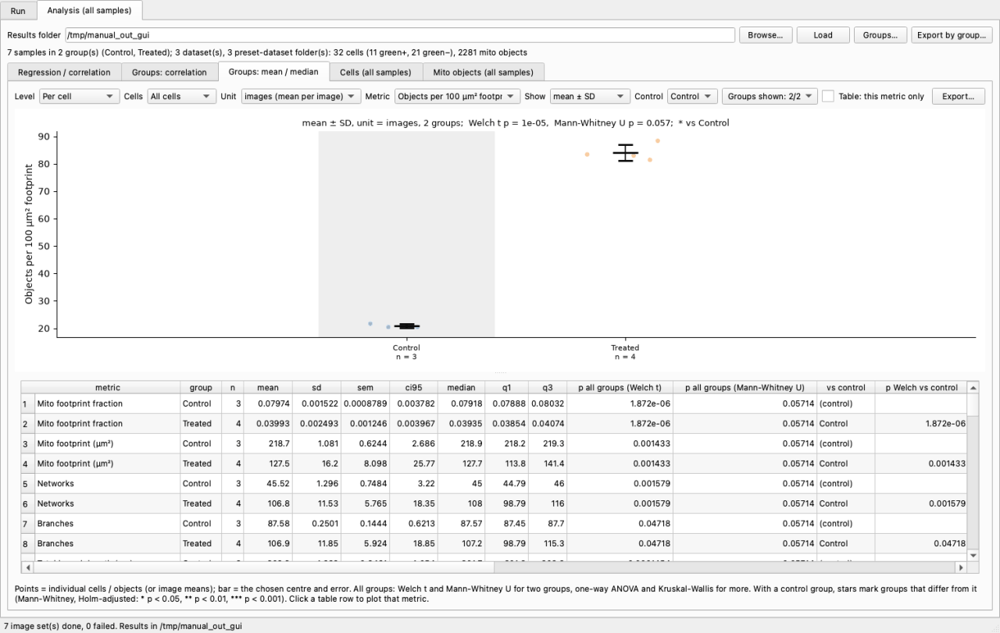
- Choose a *Metric*: the points of each group (cells or images) and mean ± SD / SEM / 95 % CI or median ± IQR (*Show*).
- *Unit*: **cells** (one point per cell) or **images** (one point per image mean). Confirm conclusions with images (section 13).
- *Control*: compare every group with the control (Mann-Whitney, Holm-adjusted); stars on the plot: `*` p<0.05, `**` p<0.01, `***` p<0.001.
- *Groups shown*: which groups to show. *Table: this metric only*: limit the table to the current metric.
- Table: n, mean, SD, SEM, 95 % CI, median, quartiles and test p values per metric × group. Click a row to plot that metric.

### 11-3. Groups: correlation
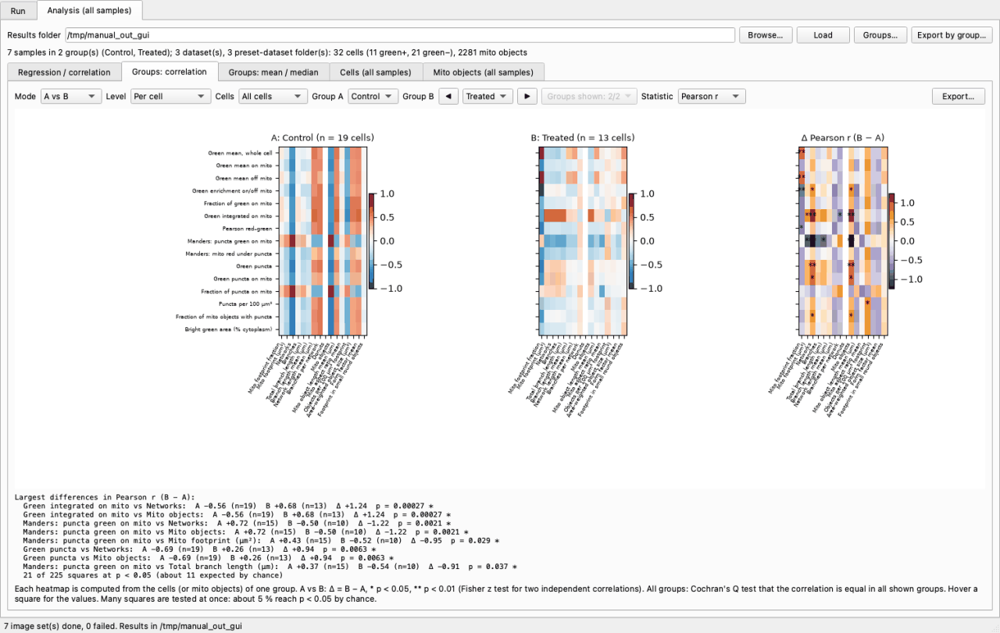
- *Mode* **A vs B**: correlation heatmaps of groups A and B and their difference (B − A), with `*` / `**` where the correlations differ (Fisher z test). ◀ ▶ steps group B through the groups.
- *Mode* **All groups**: one small heatmap per group and a map of where the correlation differs between groups (Cochran's Q).
- Below: the pairs with the largest differences, and how many squares reach p<0.05 compared with the number expected by chance.

### 11-4. Cells / Mito objects (all samples)
The cell and mito tables of all samples, with group, dataset and sample columns. Click a column header to sort.

## 12. Output files
```
<output folder>/
  groups.csv                         sample → group
  groups/                            group-wise export (written after every batch)
    groups_overview.csv              images and cells per group
    group_comparison.xlsx            metric × group comparison (all / green+ / green−; per cell / image / mito object)
    <group>/<group>_cells.csv, _mito.csv, _per_image.csv, _correlations.csv, _results.xlsx …
  <dataset>/<preset>-<dataset>/
    <preset>-<dataset>_all_cells.csv …   the samples of that folder pooled
    <sample>/                        results of one image
      <sample>_results.xlsx          all tables (green_pos / green_neg / all sheets, settings sheet)
      <sample>_per_cell.csv          cell table   (+ _green_pos / _green_neg versions)
      <sample>_per_mito.csv          mito-object table
      <sample>_green_puncta.csv      green puncta table
      <sample>_correlations.csv      correlation of every metric pair
      <sample>_RoiSet.zip            cell and nucleus ROIs for Fiji's ROI Manager (_RoiSet_filtered.zip = analysed cells)
      <sample>_mito_RoiSet.zip, _green_puncta_RoiSet.zip
      <sample>_summary.png, _green_cells.png, _green_on_mito.png, _mina_overlay.png …  check images
```
- In Excel, open `_results.xlsx` or `groups/group_comparison.xlsx`.
- ROIs in Fiji: open the original image and drop `_RoiSet.zip` onto the Fiji window.
- The *settings* sheet holds the pixel size, thresholds (used and automatic) and every option, so a result can be reproduced.

## 13. Reading the results
- What each metric means, and which go up or down with fragmentation: [metrics.md](metrics.md)
- **Cells vs images**: cells from one image tend to be alike, so per-cell p values are often too small. Check that **Unit = images** gives the same conclusion. Aim for 5 or more images per group.
- **Mito objects**: pieces of one cell are not independent, so per-object p values are very optimistic. Use them for trends only.
- **Many tests**: the 240 heatmap squares give about 5 % (12) at p<0.05 by chance. Look for **patterns that line up in the same direction**, not single squares.
- **Expression level**: green intensities (mean, integrated) follow expression. When groups differ in expression, compare ratios (fraction on mito, enrichment, Pearson, Manders); selecting green+ cells compares expressing cells only.
- **Before concluding**: look at the Cell ROIs images once.

## 14. Command line
For large batches without the window, or on a server.
```bash
# the executable inside the app
"/Applications/Mito Analyzer.app/Contents/MacOS/MitoAnalyzer" --cli --batch "My experiment/Control" -o ~/results --group Control
"/Applications/Mito Analyzer.app/Contents/MacOS/MitoAnalyzer" --cli --batch "My experiment/PRD 24h" -o ~/results --group PRD --control Control
# from source
cd mito-tracking/application && .venv/bin/python run_app.py --cli --batch FOLDER -o OUTDIR
# CZI files (one file, or folders with --batch); give the channel of each role if the guess is wrong
"/Applications/Mito Analyzer.app/Contents/MacOS/MitoAnalyzer" --cli --batch CZI_FOLDER -o ~/results --czi-channels mito=0,protein=1,nucleus=2
```
Common options: `--group NAME`, `--control GROUP`, `--pixel-size-um 0.099`, `--thr-nuclei`, `--cell-fg-level`, `--thr-mito`, `--thr-green-bright`, `--thr-puncta` (0 = auto), `--mito-method otsu`, `--no-edge-trim`, `--include-edge-cells`, `--green-pos-percent 2`. Full list: `--cli --help`.
Several runs into the same `-o` folder add up their groups, and the last run rewrites the `groups/` comparison.

## 15. Troubleshooting (FAQ)
**The app does not open / "unidentified developer"** → right-click → Open (2-1), or System Settings → Privacy & Security → Open Anyway.

**I added files but the table stays empty** → each set needs all three files ending in `…Red`, `…Green`, `…Blue`. Files that do not form a set are listed; other TIFFs such as `Merged` are ignored. A CZI file needs at least three channels and must be readable.

**A CZI file is analysed with the wrong channels** → check the Red / Green / Blue columns and fix them with **Channel roles…** (3-1).

**µm/px shows `?`** → section 8: type the value, or enter it when Run all asks.

**Two cells end up in one ROI** → fix it directly in the ROI review window (section 6-1: Subtract + New cell). If it happens in many images, usually one nucleus was not found. Lower *Nuclei* in the preview and make sure *Dim nuclei* is on.

**ROIs appear where there is no cell (fake cells)** → a smooth blue blob in the cytoplasm was taken for a nucleus. Raise *Nuclei*, or check that Nucleus detection is *Texture + merge*.

**ROIs are too large (include background) / too small** → raise / lower *Cell area* (default 0.12).

**Very few cells are analysed** → most were left out because they touch the image edge. Keep *Keep cells whose tip touches the border* on; best of all, image cells that lie fully inside the field.

**No green+ cells** → lower *Green+ cell: bright green ≥*, or *Green+ (bright green)* in the preview; check the yellow area in the Green+ / − cells tab.

**nan or – in the tables** → the value cannot be computed (fewer than 3 cells, a constant value, a cell without mitochondria …); the reason is shown on screen.

**Compare the same data with other settings** → give a different *Preset* (e.g. `thr30`) in the table; the results go to a separate folder.

**How do I update?** → DMG: install the new DMG. One-line install: run the line again. Own build: `git pull`, then `./build_mac.sh`.

**Reporting a problem** → send the `_results.xlsx` (settings sheet) of the image concerned and the Log text.
